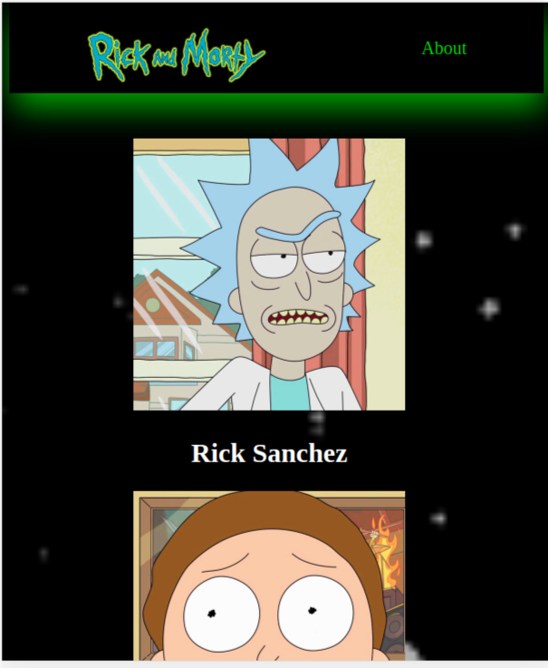
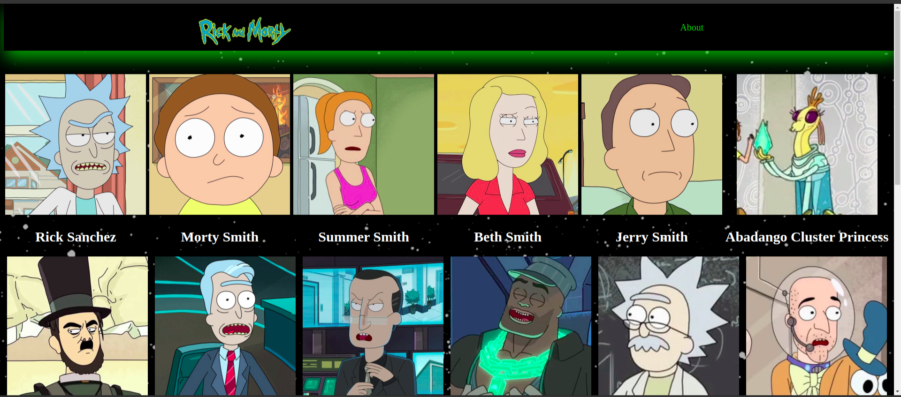
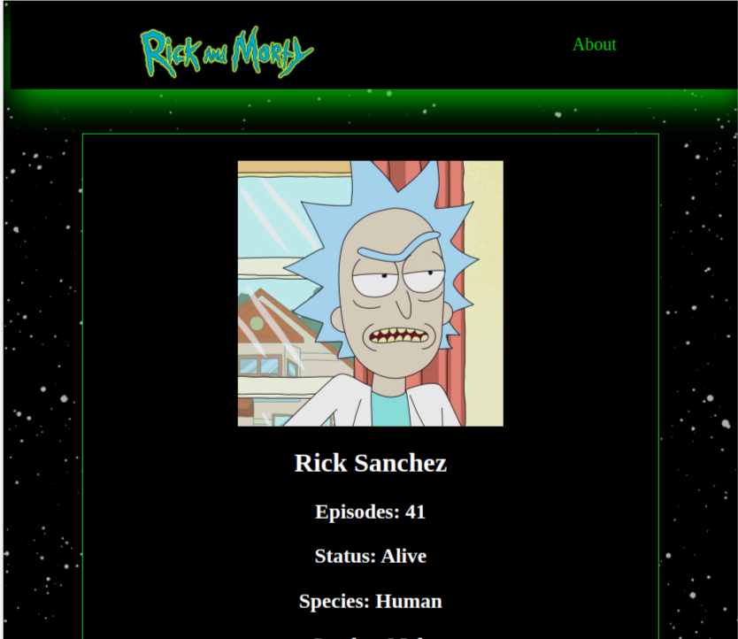
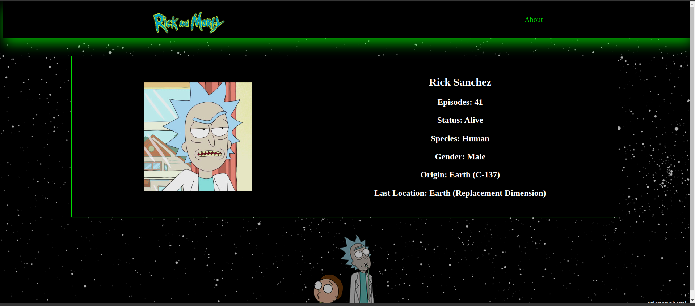

# RICK AND MORTY SPA

Implementacion de una SPA con JS VANILLA y WEBPACK. Los personajes son traidos de la API DE Rick and Morty. Proyecto del Curso de Single Page Application con JavaScript Vanilla de Platzi.

[Demo del Proyecto](https://oriananohemi.github.io/rick-and-morty-spa/#/1/)

